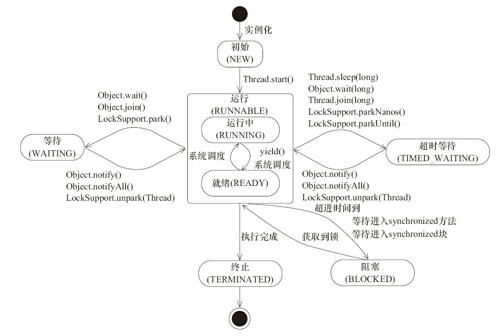

### 为什么使用多线程    
- 更多的处理器核心  
- 更快的响应时间   
- 更好的编程模型   
### 线程优先级
    操作系统采用时分的形式调度运行的线程，分出一个个时间片，线程会分配到若干时间片，
    当线程的时间片用完了就会发生线程调度，并等待着下次分配
    
    通过priority来控制优先级，范围1~10
    setPriority(int)设置优先级，默认是5，优先级高的线程分配时间片的数量要多于优先级低的线程
    
 == 线程优先级不能作为程序正确性的依赖，因为操作系统可以完全不用理会Java线程对于优先级的设定。 ==  
 ### 线程的状态
 - NEW            初始状态，线程被创建，还没有调用start()方法
 - RUNNBALE       运行状态
 - BLOCKED        阻塞状态，表示线程阻塞与锁
 - WAITITNG       等待状态，
 - TIME_WAITING   超时等待状态
 - TERMINATED     终止状态
 