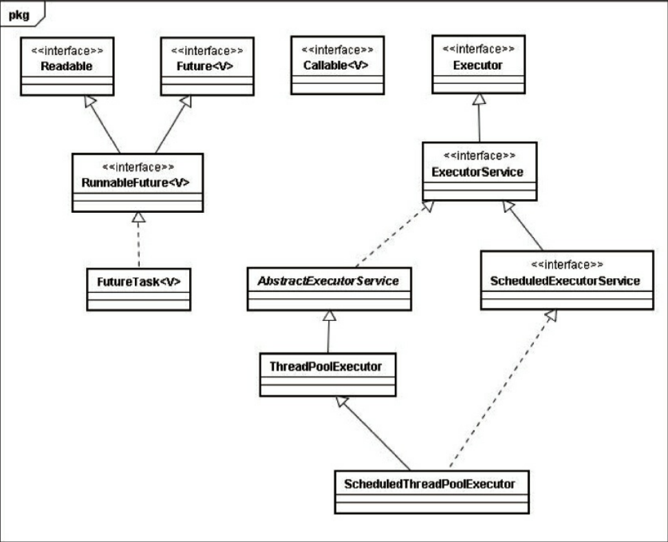
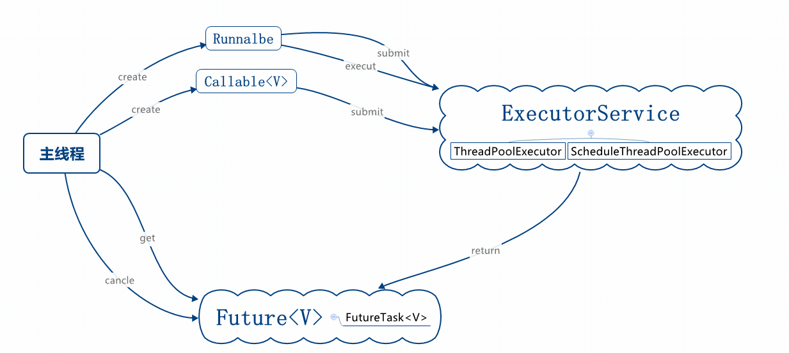
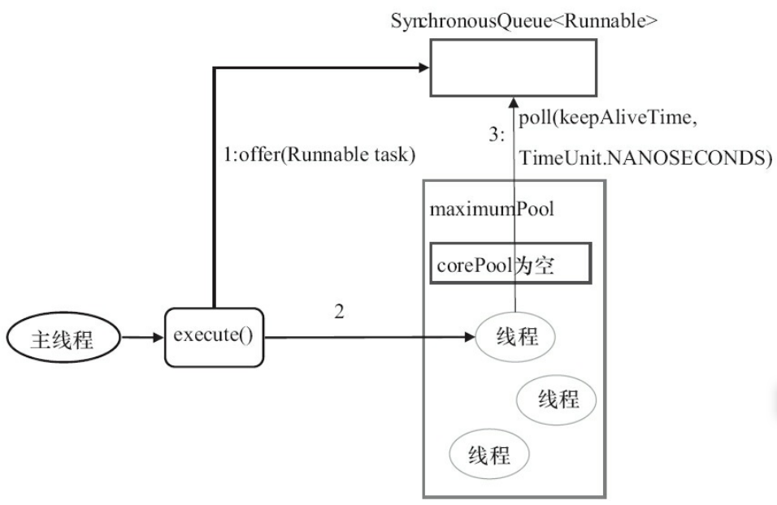

# `Executor`框架
Java线程的创建与销毁需要一定的开销，如果我们为每一个任务创建一个新线程来执行，  
这些线程的创建与销毁将消耗大量的计算资源。同时，为每一个任务创建一个新线程来执行，  
这种策略可能会使处于高负荷状态的应用最终崩溃。

从JDK 5开始，把工作单元与执行机制分离开 来。工作单元包括`Runnable`和`Callable`，   
而执行机制由`Executor`框架提供。

## `Executor`框架的结构
`Executor`框架主要由3大部分组成如下。  
- 任务。包括被执行任务需要实现的接口：`Runnable`接口或`Callable`接口。  
- 任务的执行。包括任务执行机制的核心接口`Executor`，以及继承自`Executor`的 `Executor`Service接口。
`Executor`框架有两个关键类实现了``Executor`Service`接口 （`ThreadPoolExecutor`和`ScheduledThreadPoolExecutor`）。
- 异步计算的结果。包括接口`Future`和实现`Future`接口的`FutureTask`类。   

## `Executor`框架包含的主要的类与接口

`Executor`是一个接口，它是`Executor`框架的基础，它将任务的提交与任务的执行分离开来。    
- ThreadPool`Executor`是线程池的核心实现类，用来执行被提交的任务。
- ScheduledThreadPool`Executor`是一个实现类，可以在给定的延迟后运行命令，或者定期执行命令。
ScheduledThreadPool`Executor`比Timer更灵活，功能更强大。     
- Future接口和实现Future接口的FutureTask类，代表异步计算的结果。 
- Runnable接口和Callable接口的实现类，都可以被`ThreadPoolExecutor`或`ScheduledThreadPoolExecutor`执行。 



## `Executor`框架的成员
`Executor`框架的主要成员：`ThreadPoolExecutor`、`ScheduledThreadPoolExecutor`、`Future`接口、`Runnable`接口、`Callable`接口和`Executors`。    
- `ThreadPoolExecutor`通常使用工厂类`Executors`来创建。
`Executors`可以创建3种类型的 `ThreadPoolExecutor`：`SingleThreadExecutor`、`FixedThreadPool`和`CachedThreadPool`。
    - FixedThreadPool适用于为了满足资源管理的需求，而需要限制当前线程数量的应用场景，它适用于负载比较重的服务器。   
        ```text
        public static ExecutorService newFixedThreadPool(int nThreads)  
        public static ExecutorService newFixedThreadPool(int nThreads, ThreadFactory threadFactory)     
         ```
    - SingleThreadExecutor创建使用单个线程的SingleThreadExecutor的API。适用于需要保证顺序地执行各个任务；并且在任意时间点，不会有多个线程是活动的应用场景。    
        ```text
        public static ExecutorService newSingleThreadExecutor()     
        public static ExecutorService newSingleThreadExecutor(ThreadFactory threadFactory)      
        ```
    - CachedThreadPool是大小无界的线程池，适用于执行很多的短期异步任务的小程序，或者是负载较轻的服务器。      
        ```text
        public static `Executor`Service newCachedThreadPool()         
        public static `Executor`Service newCachedThreadPool(ThreadFactory threadFactory)      
        ```
- ScheduledThreadPoolExecutor通常使用工厂类`Executors`来创建        
`Executors`可以创建2种类型的`ScheduledThreadPoolExecutor`：`ScheduledThreadPoolExecutor`，`SingleThreadScheduledExecutor`    
    - `ScheduledThreadPoolExecutor`。包含若干个线程的`ScheduledThreadPoolExecutor`。  
     ```text
    适用于需要多个后台线程执行周期任务，同时为了满足资源 管理的需求而需要限制后台线程的数量的应用场景   
    public static ScheduledExecutorService newScheduledThreadPool(int corePoolSize)         
    public static ScheduledExecutorService newScheduledThreadPool(int corePoolSize,ThreadFactory threadFactory) 
    ```     
    - `SingleThreadScheduledExecutor`。只包含一个线程的`ScheduledThreadPoolExecutor`。    
    适用于需要单个后台线程执行周期任务，同时需要保证顺 序地执行各个任务的应用场景。   
    ```text
    public static ScheduledExecutorService newSingleThreadScheduledExecutor()           
    public static ScheduledExecutorService newSingleThreadScheduledExecutor(ThreadFactory threadFactory)   
    ```
- Future接口  
`Future`接口和实现`Future`接口的`FutureTask`类用来表示异步计算的结果。     
```text
<T> Future<T> submit(Callable<T> task)      
<T> Future<T> submit(Runnable task, T result)       
Future<> submit(Runnable task)
```
- Runnable接口和Callable接口 
`Runnable`接口和`Callable`接口的实现类，都可以被`ThreadPoolExecutor`或`ScheduledThreadPoolExecutor`执行。   
它们之间的区别是`Runnable`不会返回结果，而`Callable`可以返回结果。

除了可以自己创建实现`Callable`接口的对象外，还可以使用工厂类`Executors`来把一个`Runnable`包装成一个`Callable`。   
```text
public static Callable<Object> callable(Runnable task) // 假设返回对象Callable1   
public static <T> Callable<T> callable(Runnable task, T result) // 假设返回对象Callable    
```

# ThreadPoolExecutor详解

`Executor`框架最核心的类是`ThreadPoolExecutor`，它是线程池的实现类,下面是他的构造器
```text
public ThreadPoolExecutor(int corePoolSize,        //核心线程池大小
                              int maximumPoolSize,
                              long keepAliveTime,
                              TimeUnit unit,
                              BlockingQueue<Runnable> workQueue,
                              ThreadFactory threadFactory,
                              RejectedExecutionHandler handler) {
                              ........
                              }
```
|序号|名称|类型|含义|
|:---|:---|:---|:---|
|1|corePoolSize|int|核心线程池大小|
|2|maximumPoolSize|int|最大线程池大小|
|3|keepAliveTime|long|线程最大空闲时间|
|4|unit|TimeUnit|时间单位|
|5|workQueue|BlockingQueueThreadFactorynnable>|线程等待队列|
|6|threadFactory|ThreadFactory|线程创建工厂|
|7|handler|RejectedExecutionHandler|拒绝策略|

## FixedThreadPool详解
`FixedThreadPool`被称为可重用固定线程数的线程池。 
```text
* @param corePoolSize the number of threads to keep in the pool, even
*        if they are idle, unless {@code allowCoreThreadTimeOut} is set
* @param maximumPoolSize the maximum number of threads to allow in the
*        pool
 public static ExecutorService newFixedThreadPool(int nThreads) {
        return new ThreadPoolExecutor(nThreads, nThreads,
                                      0L, TimeUnit.MILLISECONDS,
                                      new LinkedBlockingQueue<Runnable>());
    }
```
通过构造器可以看到`FixedThreadPool`的`corePoolSize`，`maximumPoolSize`都被设置为创建时传入构造器nThreads；      
当线程池中的线程数大于`corePoolSize`时，`keepAliveTime`为多余的空闲线程等待新任务的最长时间，超过这个时间后多余的线程将被终止。     
这里把keepAliveTime设置为0L，意味着多余的空闲线程会被立即终止。     
由于在FixedThreadPool中使用无界队列LinkedBlockingQueue作为线程池的工作队列（队列的容量为 Integer.MAX_VALUE）。   
并且corePoolSize与maximumPoolSize大小一样，所以，当线程池中的线程数达到corePoolSize后，新任务将在无界队列中等待，因此线程池中的线程数不会超过corePoolSize。     
`maximumPoolSize`与`keepAliveTime`将会不起左右，是一个无效的参数。   
由于使用无界队列，运行中的`FixedThreadPool`（未执行方法`shutdown()`或 `shutdownNow()`）不会拒绝任务（不会调用RejectedExecutionHandler.rejectedExecution方法）。  

**注意：在高并发情况下，使用`FixedThreadPool`作为线程池的时候，当并发量过大，可能会出现线程积压，从而撑破内存**
**注意：在使用`FixedThreadPool`作为线程池并与CyclicBarrier结合使用的时候，当CyclicBarrier的初始化`parties`参数大于`FixedThreadPool`的
`nThreads`的大小时，会发生线程阻塞，[示例代码](../src/main/java/chapter10/ThreadPoolExecutorText)**
## SingleThreadExecutor详解
SingleThreadExecutor是使用单个worker线程的Executor。     
```text
public static ExecutorService newSingleThreadExecutor() {
        return new FinalizableDelegatedExecutorService
            (new ThreadPoolExecutor(1, 1,
                                    0L, TimeUnit.MILLISECONDS,
                                    new LinkedBlockingQueue<Runnable>()));
    }
```
通过构造器可以看到，`SingleThreadExecutor`即是`FixedThreadPool`参数为`1`的情况。
## CachedThreadPool详解
CachedThreadPool是一个会根据需要创建新线程的线程池。
```text
public static ExecutorService newCachedThreadPool() {
    return new ThreadPoolExecutor(0, Integer.MAX_VALUE, 60L, TimeUnit.SECONDS, new SynchronousQueue<Runnable>()); }

```
CachedThreadPool的corePoolSize被设置为0，即corePool为空；maximumPoolSize被设置为 Integer.MAX_VALUE，即maximumPool是无界的。  
这里把keepAliveTime设置为60L，意味着 CachedThreadPool中的空闲线程等待新任务的最长时间为60秒，空闲线程超过60秒后将会被终止。 
       


SynchronousQueue是一个没有容量的阻塞队列，它就相当于一个中转站，当主线程提交任务后，它就把任务提交给空闲线程

**CachedThreadPool使用没有容量的SynchronousQueue作为线程池的工作队列，但 CachedThreadPool的maximumPool是无界的。
这意味着，如果主线程提交任务的速度高于 maximumPool中线程处理任务的速度时，CachedThreadPool会不断创建新线程。极端情况下， 
CachedThreadPool会因为创建过多线程而耗尽CPU和内存资源。**